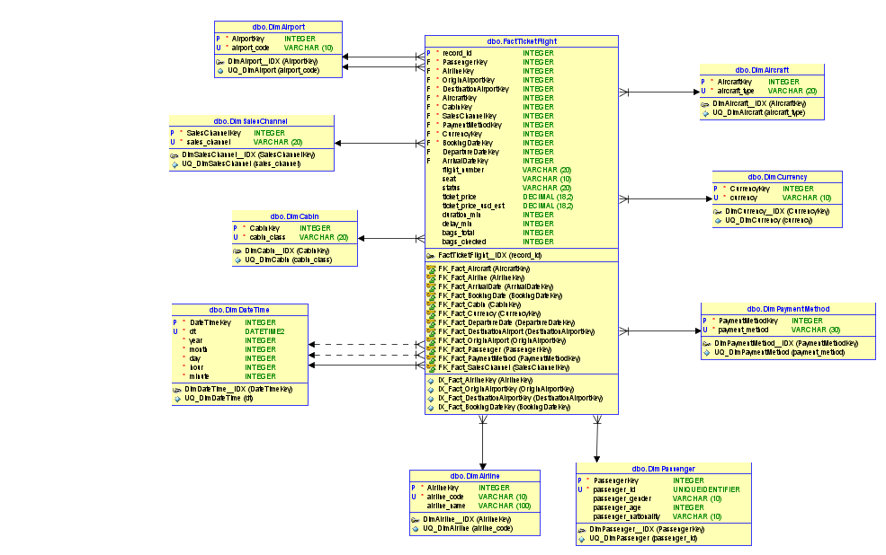

# Práctica 1 — ETL con Python: de dataset crudo a tabla relacional lista para análisis

**Curso:** Seminario de Sistemas 2   
**Estudiante:** César Fernando Sazo Quisquinay  
**Carnet:** 202202906  
**Repositorio:** `SS22S2026_202202906/Practica1`

---

## 1. Objetivo
Implementar un proceso ETL completo en **Python** que extraiga, transforme y cargue datos desde dos fuentes (datasets crudos) hacia un **modelo multidimensional (modelo estrella)** implementado en **SQL Server**, para habilitar consultas analíticas e indicadores de negocio.

---

## 2. Fuentes de datos
Se utilizaron dos archivos CSV:

- **Dataset 1 (`Dataset 1.csv`)**: información del vuelo y operación  
  Columnas principales: `record_id`, `airline_code`, `airline_name`, `flight_number`, `origin_airport`, `destination_airport`, `departure_datetime`, `arrival_datetime`, `duration_min`, `status`, `delay_min`, `aircraft_type`, `cabin_class`, `seat`.

- **Dataset 2 (`Dataset 2.csv`)**: información del pasajero y compra del ticket  
  Separador `;`  
  Columnas principales: `passenger_id`, `passenger_gender`, `passenger_age`, `passenger_nationality`, `booking_datetime`, `sales_channel`, `payment_method`, `ticket_price`, `currency`, `ticket_price_usd_est`, `bags_total`, `bags_checked`.

> **Integración:** ambos datasets se integran por `record_id` (se genera `record_id` en Dataset 2 con base en el orden de filas).

---

## 3. Modelo de datos (Modelo Estrella)
Se implementó un **modelo estrella**, donde una **tabla de hechos** central almacena las métricas del evento (ticket/vuelo) y se conecta a tablas de dimensión que permiten el análisis desde múltiples perspectivas.

### 3.1 Granularidad (Hecho)
**1 fila en FactTicketFlight = 1 ticket/registro (`record_id`)**  
Representa un evento de compra/vuelo asociado a un pasajero.

### 3.2 Tabla de Hechos
**FactTicketFlight**
- **Métricas (medidas):**
  - `ticket_price`, `ticket_price_usd_est`
  - `duration_min`, `delay_min`
  - `bags_total`, `bags_checked`
- **Atributos del evento:**
  - `status`, `flight_number`, `seat`
- **Llaves foráneas hacia dimensiones:**
  - Passenger, Airline, Airports (origen/destino), Aircraft, Cabin, SalesChannel, PaymentMethod, Currency, DateTime (booking/departure/arrival)

### 3.3 Dimensiones
- **DimPassenger**: pasajero (género, edad, nacionalidad)
- **DimAirline**: aerolínea
- **DimAirport**: aeropuerto (utilizada dos veces: origen y destino)
- **DimAircraft**: tipo de aeronave
- **DimCabin**: clase de cabina
- **DimSalesChannel**: canal de venta
- **DimPaymentMethod**: método de pago
- **DimCurrency**: moneda
- **DimDateTime**: fecha/hora (reutilizada para booking, departure y arrival)



---

## 4. Proceso ETL

### 4.1 Extract (Extracción)
- Se cargan los datasets con `pandas`.
- `Dataset 2` se lee usando separador `;`.

### 4.2 Transform (Transformación)
Transformaciones aplicadas:
- Conversión de fechas a tipo datetime: `booking_datetime`, `departure_datetime`, `arrival_datetime`.
- Conversión de valores numéricos: `ticket_price`, `ticket_price_usd_est`, `duration_min`, `delay_min`, `bags_total`, `bags_checked`.
- Limpieza y estandarización de textos (trim, mayúsculas).
- **Homologación de género** para evitar categorías duplicadas (ej. M/MASCULINO, F/FEMENINO).
- Manejo de nulos (por ejemplo, vuelos cancelados sin fechas de salida/llegada).

### 4.3 Load (Carga)
Orden de carga:
1. Inserción de **dimensiones** (sin duplicados) en SQL Server.
2. Generación de **mapeos de llaves subrogadas** (surrogate keys).
3. Inserción de **hechos** en `FactTicketFlight` con llaves foráneas correctas.

---

## 5. Requerimientos técnicos
- Python 3.10+
- SQL Server (Docker)
- Librerías: `requirements.txt`

---

## 6. Ejecución del proyecto

### 6.1 Levantar SQL Server con Docker
```bash
docker run -e "ACCEPT_EULA=Y" -e "MSSQL_SA_PASSWORD=TuPassword123!" \
  -p 1433:1433 --name sqlserver-ss22 \
  -v sqlserverdata:/var/opt/mssql \
  -d mcr.microsoft.com/mssql/server:2022-latest
```

### 6.2 Crear Base de Datos
```sql
    CREATE DATABASE SS22_Practica1;
    GO
```

### 6.3 Crear Esquema
Ejecutar el script:
- `sql/schema.sql`

## 7. Consultas
Las consultas analíticas se encuentran en:

- `sql/queries.sql`

Ejemplos:

- Top 5 destinos más frecuentes

- Distribución por género

- Promedio de delay por aerolínea

- Ingreso estimado por canal de venta

- Tickets por mes (booking)