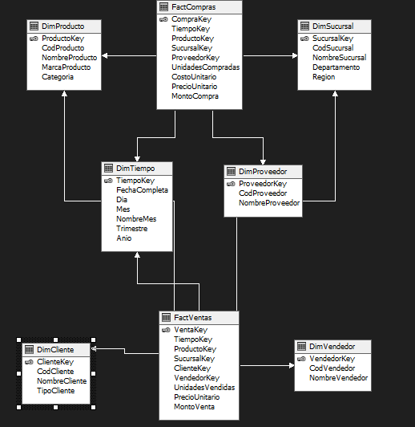
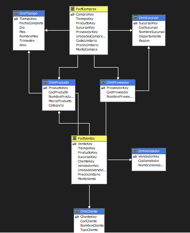
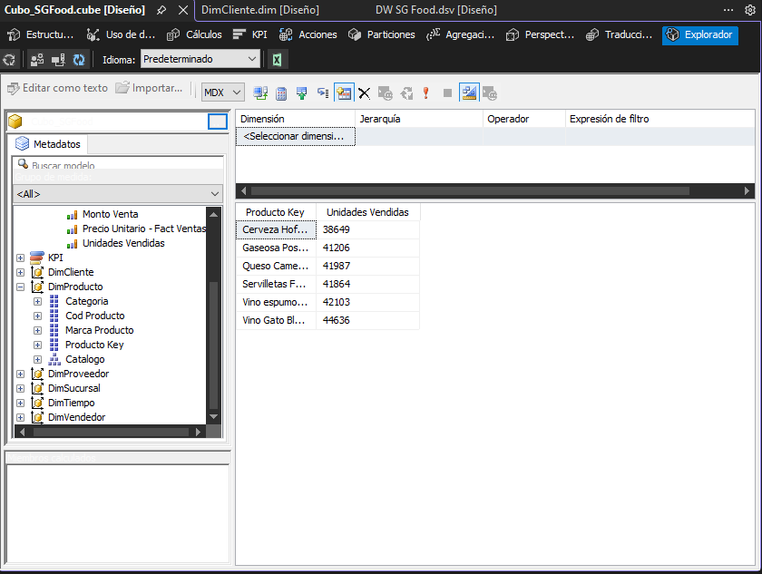
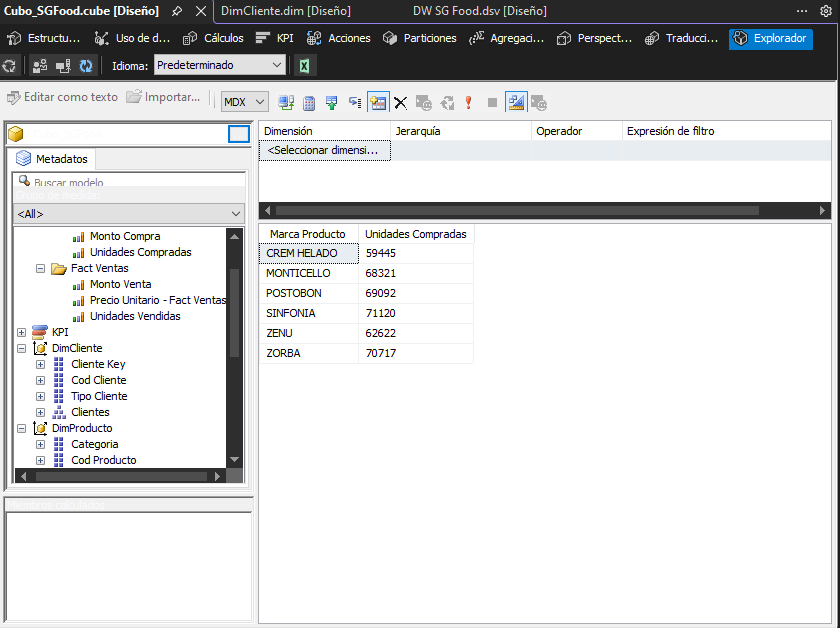
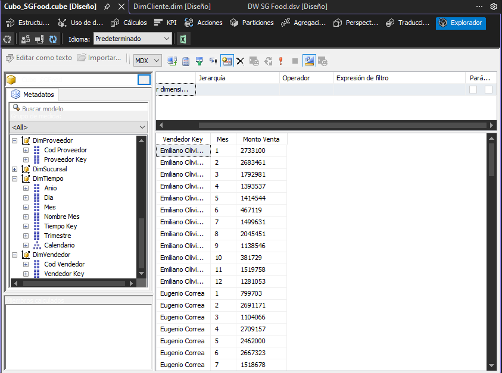
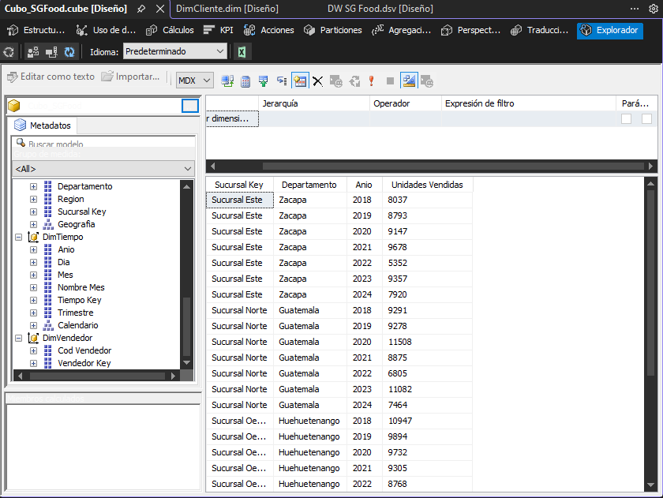

# Proyecto 1 — Implementación del flujo completo de Microsoft con SSIS y SSAS en SQL Server

**Curso:** Seminario de Sistemas 2  
**Universidad:** San Carlos de Guatemala — Facultad de Ingeniería  
**Empresa:** SG-Food  
**Instancia SQL Server:** `localhost\MSSQLSERVER01`

---

# 1. Descripción del Proyecto

Este proyecto implementa una solución completa de Business Intelligence para la empresa SG-Food, dedicada a la distribución y comercialización de productos de diversas marcas y categorías. La solución abarca tres componentes principales:

- Un proceso ETL desarrollado en **SQL Server Integration Services (SSIS)** que extrae, limpia y transforma datos desde archivos CSV hacia el Data Warehouse.
- Un **Data Warehouse** implementado en SQL Server bajo un modelo constelación con tablas de hechos y dimensiones.
- Un modelo analítico multidimensional construido en **SQL Server Analysis Services (SSAS)** con dimensiones, jerarquías y medidas para análisis de ventas e inventarios.

Las fuentes de datos son dos archivos CSV (`compras.csv` y `ventas.csv`) con información transaccional de compras a proveedores y ventas a clientes.

---

# 2. Modelo Multidimensional

Se implementó un **modelo constelación (Constellation Schema)** como arquitectura del Data Warehouse por las siguientes razones:

**Dos procesos de negocio diferenciados:** SG-Food maneja dos flujos independientes — compras a proveedores y ventas a clientes — cada uno con sus propias métricas y actores. Modelar ambos en una única tabla de hechos mezclaría conceptos distintos. El modelo constelación permite tener `FactCompras` y `FactVentas` como tablas de hechos independientes.

**Dimensiones compartidas:** Ambas tablas de hechos comparten `DimTiempo`, `DimProducto` y `DimSucursal`, garantizando consistencia en el análisis cruzado — por ejemplo, comparar el costo de adquisición de un producto contra su precio de venta por sucursal y período.

**Escalabilidad:** La separación de hechos facilita agregar nuevos procesos de negocio en el futuro sin modificar las tablas existentes.



---

# 3. Decisiones de Diseño y Justificaciones

## 3.1 Tablas del Modelo

### FactCompras
Registra cada transacción de compra realizada a proveedores. Almacena las métricas del proceso de abastecimiento: unidades compradas, costo unitario y monto total calculado. Se relaciona con `DimTiempo`, `DimProveedor`, `DimProducto` y `DimSucursal`.

### FactVentas
Registra cada transacción de venta realizada a clientes. Almacena las métricas del proceso comercial: unidades vendidas, precio unitario y monto total calculado. Se relaciona con `DimTiempo`, `DimCliente`, `DimVendedor`, `DimProducto` y `DimSucursal`.

### Dimensiones

| Dimensión | Descripción | Compartida |
|---|---|---|
| `DimTiempo` | Descompone cada fecha en día, mes, trimestre y año para análisis temporales | Sí |
| `DimProducto` | Identifica cada producto con su código, nombre, marca y categoría | Sí |
| `DimSucursal` | Representa cada punto de operación con su nombre, región y departamento | Sí |
| `DimProveedor` | Identifica al proveedor de cada transacción de compra | Solo compras |
| `DimCliente` | Contiene el perfil del cliente con su código, nombre y tipo | Solo ventas |
| `DimVendedor` | Identifica al vendedor responsable de cada transacción de venta | Solo ventas |

---

# 4. SQL Server Integration Services (SSIS) — Proceso ETL

## 4.1 Descripción General

El proceso ETL fue implementado en SSIS dentro de Visual Studio 2022 usando dos paquetes independientes: `ETL_Compras.dtsx` y `ETL_Ventas.dtsx`. Cada paquete sigue la misma arquitectura: limpieza de datos, deduplicación, resolución de claves foráneas mediante Lookups y carga al Data Warehouse.

## 4.2 Fuentes de Datos

El enunciado describe fuentes con delimitador `|` y extensiones `.comp` y `.vent`. Los archivos provistos para este proyecto son archivos CSV con delimitador coma, los cuales contienen la misma estructura de datos descrita. El ETL fue implementado conforme a los archivos realmente proporcionados.

| Archivo | Descripción | Delimitador | Encoding | Registros |
|---|---|---|---|---|
| `compras.csv` | Transacciones de compras a proveedores | `,` | UTF-8 (65001) | 1,000 |
| `ventas.csv` | Transacciones de ventas a clientes | `,` | UTF-8 (65001) | 1,000 |

## 4.3 Problemas de Calidad de Datos Identificados

Durante el análisis de los archivos de entrada se identificaron los siguientes problemas de calidad de datos:

| Problema | Archivo | Campo | Ejemplo | Solución aplicada |
|---|---|---|---|---|
| Fecha con carácter inválido Z | compras.csv | Fecha | `03/08/Z018` | `REPLACE([Fecha],"Z","2")` en Columna derivada |
| Fecha con carácter inválido Z | ventas.csv | Fecha | `Z3/08/2018` | `REPLACE([Fecha],"Z","2")` en Columna derivada |
| Fecha con carácter inválido Z | ventas.csv | Fecha | `06/1Z/2020` | `REPLACE([Fecha],"Z","2")` en Columna derivada |
| Unidades negativas | compras.csv | Unidades | `-75` | `[Unidades] < 0 ? [Unidades] * -1 : [Unidades]` |
| Unidades negativas | ventas.csv | Unidades | `-88` | `[Unidades] < 0 ? [Unidades] * -1 : [Unidades]` |
| Costo unitario negativo | compras.csv | CostoUnitario | `-401.05` | `[CostoUnitario] < 0 ? [CostoUnitario] * -1 : [CostoUnitario]` |
| Precio unitario negativo | ventas.csv | PrecioUnitario | `-285.09` | `[PrecioUnitario] < 0 ? [PrecioUnitario] * -1 : [PrecioUnitario]` |

## 4.4 ETL_Compras.dtsx

### Control Flow

El paquete ejecuta las tareas en este orden para garantizar integridad referencial — las dimensiones se cargan antes que la tabla de hechos:

```
[Cargar DimProducto]
        ↓
[Cargar DimSucursal]
        ↓
[Cargar DimProveedor]
        ↓
[Cargar FactCompras]
```

### Data Flow — Dimensiones (DimProducto, DimSucursal, DimProveedor)

Cada dimensión sigue el mismo patrón:

```
[Origen de archivo plano: compras.csv]
        ↓
[Ordenar] ← elimina duplicados por código único
        ↓
[Destino OLE DB] ← inserta en la dimensión correspondiente
```

El componente **Ordenar** tiene habilitada la opción "Quitar filas con valores de ordenación duplicados", garantizando que cada código (CodProducto, CodSucursal, CodProveedor) se inserte una sola vez.

### Data Flow — FactCompras

```
[Origen de archivo plano: compras.csv]
        ↓
[Columna derivada] ← limpieza y cálculo de medidas
        ↓
[Lookup DimProducto] ← obtiene ProductoKey
        ↓
[Lookup DimSucursal] ← obtiene SucursalKey
        ↓
[Lookup DimProveedor] ← obtiene ProveedorKey
        ↓
[Columna derivada: TiempoKey] ← calcula YYYYMMDD
        ↓
[Lookup DimTiempo] ← obtiene TiempoKey
        ↓
[Destino OLE DB: FactCompras]
```

### Transformaciones en Columna Derivada — Compras

| Columna creada | Expresión | Propósito |
|---|---|---|
| `FechaLimpia` | `REPLACE([Fecha],"Z","2")` | Corrige fechas con carácter Z inválido |
| `UnidadesLimpia` | `[Unidades] < 0 ? [Unidades] * -1 : [Unidades]` | Convierte unidades negativas a positivas |
| `CostoLimpio` | `[CostoUnitario] < 0 ? [CostoUnitario] * -1 : [CostoUnitario]` | Convierte costos negativos a positivos |
| `MontoCompra` | `[UnidadesLimpia] * [CostoLimpio]` | Calcula monto total usando valores ya limpios |
| `TiempoKey` | `(DT_I4)(YEAR((DT_DBDATE)[FechaLimpia]) * 10000 + MONTH((DT_DBDATE)[FechaLimpia]) * 100 + DAY((DT_DBDATE)[FechaLimpia]))` | Genera clave YYYYMMDD para DimTiempo |

### Lookups — FactCompras

| Lookup | Columna JOIN | Columna obtenida |
|---|---|---|
| Lookup DimProducto | `CodProducto` | `ProductoKey` |
| Lookup DimSucursal | `CodSucursal` | `SucursalKey` |
| Lookup DimProveedor | `CodProveedor` | `ProveedorKey` |
| Lookup DimTiempo | `TiempoKey` | `TiempoKey` |

## 4.5 ETL_Ventas.dtsx

### Control Flow

```
[Cargar DimCliente]
        ↓
[Cargar DimVendedor]
        ↓
[Cargar FactVentas]
```

`DimProducto`, `DimSucursal` y `DimTiempo` ya fueron pobladas por `ETL_Compras.dtsx` y los Lookups de ventas las encuentran directamente.

### Transformaciones en Columna Derivada — Ventas

| Columna creada | Expresión | Propósito |
|---|---|---|
| `FechaLimpia` | `REPLACE([Fecha],"Z","2")` | Corrige fechas con carácter Z inválido |
| `UnidadesLimpia` | `[Unidades] < 0 ? [Unidades] * -1 : [Unidades]` | Convierte unidades negativas a positivas |
| `PrecioLimpio` | `[PrecioUnitario] < 0 ? [PrecioUnitario] * -1 : [PrecioUnitario]` | Convierte precios negativos a positivos |
| `MontoVenta` | `[UnidadesLimpia] * [PrecioLimpio]` | Calcula monto total usando valores ya limpios |
| `TiempoKey` | `(DT_I4)(YEAR((DT_DBDATE)[FechaLimpia]) * 10000 + MONTH((DT_DBDATE)[FechaLimpia]) * 100 + DAY((DT_DBDATE)[FechaLimpia]))` | Genera clave YYYYMMDD para DimTiempo |

### Lookups — FactVentas

| Lookup | Columna JOIN | Columna obtenida |
|---|---|---|
| Lookup DimProducto | `CodProducto` | `ProductoKey` |
| Lookup DimSucursal | `CodSucursal` | `SucursalKey` |
| Lookup DimCliente | `CodCliente` | `ClienteKey` |
| Lookup DimVendedor | `CodVendedor` | `VendedorKey` |
| Lookup DimTiempo | `TiempoKey` | `TiempoKey` |

---

# 5. SQL Server Analysis Services (SSAS) — Modelo Analítico

## 5.1 Descripción General

El modelo analítico fue implementado en SSAS en modalidad multidimensional, conectado al Data Warehouse `DW_SGFood` en la instancia `localhost\MSSQLSERVER01`. El cubo permite realizar consultas analíticas sobre los procesos de ventas y compras desde múltiples perspectivas dimensionales.

## 5.2 Origen de Datos y Vista

Se creó un origen de datos apuntando a la instancia `localhost\MSSQLSERVER01` usando autenticación de Windows. La vista del origen de datos incluye las 8 tablas del Data Warehouse con sus relaciones detectadas automáticamente.

## 5.3 Cubo — Cubo_SGFood

El cubo fue creado con dos grupos de medidas correspondientes a las tablas de hechos:

| Tabla de Hechos | Medidas |
|---|---|
| FactCompras | UnidadesCompradas, CostoUnitario, MontoCompra |
| FactVentas | UnidadesVendidas, PrecioUnitario, MontoVenta |

## 5.4 Dimensiones y Jerarquías

| Dimensión | Atributos | Jerarquía | Niveles |
|---|---|---|---|
| DimTiempo | Dia, Mes, NombreMes, Trimestre, Anio | Calendario | Anio > Trimestre > Mes > Dia |
| DimProducto | CodProducto, MarcaProducto, Categoria | Catalogo | Categoria > MarcaProducto > Producto |
| DimSucursal | CodSucursal, Departamento, Region | Geografia | Region > Departamento > Sucursal |
| DimProveedor | CodProveedor, NombreProveedor | — | Sin jerarquía |
| DimCliente | CodCliente, TipoCliente | Clientes | TipoCliente > Cliente |
| DimVendedor | CodVendedor, NombreVendedor | — | Sin jerarquía |

## 5.5 Implementación y Procesamiento

El proyecto fue implementado en la instancia `localhost\MSSQLSERVER01` de Analysis Services. Una vez implementado se ejecutó un proceso completo del cubo procesando correctamente 1,000 registros de compras y 1,000 registros de ventas distribuidos en 6 dimensiones.



---

# 6. Validación del Flujo Completo

## 6.1 Conteo de registros cargados

| Tabla | Filas cargadas |
|---|---|
| DimTiempo | 5,844 |
| DimProducto | 6 |
| DimSucursal | 4 |
| DimProveedor | 101 |
| DimCliente | 109 |
| DimVendedor | 10 |
| FactCompras | 1,000 |
| FactVentas | 1,000 |

## 6.2 Consultas Analíticas en SSAS

### Consulta 1 — Unidades vendidas por producto

Analiza el volumen total de ventas por cada producto, permitiendo identificar cuáles tienen mayor demanda.



**Interpretación:** Los 6 productos manejados por SG-Food presentan volúmenes de venta similares entre sí. Vino Gato Blanco lidera con 44,636 unidades vendidas, seguido por Queso Camembert con 43,509 unidades y Gaseosa Postobon Uva con 42,552 unidades. Cerveza Hofbrau Munchen presenta el menor volumen con 39,457 unidades. La distribución relativamente uniforme indica que ningún producto domina la demanda de forma excesiva, lo que sugiere un portafolio equilibrado.

### Consulta 2 — Unidades compradas por producto y trimestre por año

Muestra el comportamiento de las compras por producto desglosado por trimestre y año, permitiendo identificar estacionalidad en el abastecimiento.


**Interpretación:** Las compras se distribuyen de forma relativamente uniforme a lo largo de los trimestres en todos los años analizados (2018–2024). No se observa una estacionalidad marcada, lo que indica que el abastecimiento de SG-Food sigue un patrón continuo sin picos estacionales significativos. Esto permite una planificación de inventario más predecible.

### Consulta 3 — Marcas de productos y sus unidades compradas

Analiza el volumen de compras agrupado por marca, permitiendo identificar qué marcas concentran mayor inversión en abastecimiento.



**Interpretación:** SINFONIA lidera las compras con 75,436 unidades, seguida de ZORBA con 74,760 unidades. POSTOBON y MONTICELLO se ubican en posiciones intermedias con 69,716 y 68,979 unidades respectivamente. CREM HELADO presenta el menor volumen con 60,793 unidades. La diferencia entre la marca con mayor y menor volumen es de aproximadamente 15,000 unidades, indicando una dependencia moderada de las marcas líderes.

### Consulta 4 — Ventas del vendedor por mes

Muestra el desempeño mensual de cada vendedor en términos de unidades vendidas, permitiendo identificar tendencias de rendimiento individual.



**Interpretación:** Los 10 vendedores presentan variaciones mensuales en su desempeño. Se identifican meses con mayor actividad comercial donde varios vendedores alcanzan sus picos de ventas simultáneamente, lo que podría indicar campañas o temporadas de mayor demanda. Esta vista permite al equipo comercial identificar vendedores con desempeño consistente versus aquellos con alta variabilidad mensual.

### Consulta 5 — Ventas por sucursal, departamento y año

Analiza el volumen de ventas por sucursal desglosado por departamento y año, permitiendo identificar qué zonas geográficas generan mayor actividad comercial.



**Interpretación:** La Sucursal Oeste ubicada en la región Occidente lidera las ventas con 68,346 unidades, seguida por Sucursal Norte en la región Metropolitana con 64,303 unidades. Sucursal Sur en Suroccidente registra 61,562 unidades y Sucursal Este en Nororiente presenta el menor volumen con 59,956 unidades. La distribución geográfica muestra que todas las sucursales tienen rendimientos similares con una diferencia máxima de aproximadamente 8,000 unidades entre la de mayor y menor desempeño.

## 6.3 Scripts de Validación en SQL Server

```sql
USE DW_SGFood;

-- Conteo general
SELECT 'DimTiempo'   AS Tabla, COUNT(*) AS Filas FROM dbo.DimTiempo
UNION ALL SELECT 'DimProducto',  COUNT(*) FROM dbo.DimProducto
UNION ALL SELECT 'DimSucursal',  COUNT(*) FROM dbo.DimSucursal
UNION ALL SELECT 'DimProveedor', COUNT(*) FROM dbo.DimProveedor
UNION ALL SELECT 'DimCliente',   COUNT(*) FROM dbo.DimCliente
UNION ALL SELECT 'DimVendedor',  COUNT(*) FROM dbo.DimVendedor
UNION ALL SELECT 'FactCompras',  COUNT(*) FROM dbo.FactCompras
UNION ALL SELECT 'FactVentas',   COUNT(*) FROM dbo.FactVentas;

-- Ventas por categoría de producto y año
SELECT t.Anio, p.Categoria, SUM(v.MontoVenta) AS TotalVentas
FROM dbo.FactVentas v
JOIN dbo.DimTiempo t ON v.TiempoKey = t.TiempoKey
JOIN dbo.DimProducto p ON v.ProductoKey = p.ProductoKey
GROUP BY t.Anio, p.Categoria
ORDER BY t.Anio, TotalVentas DESC;

-- Compras por proveedor
SELECT pr.NombreProveedor, SUM(c.MontoCompra) AS TotalCompras
FROM dbo.FactCompras c
JOIN dbo.DimProveedor pr ON c.ProveedorKey = pr.ProveedorKey
GROUP BY pr.NombreProveedor
ORDER BY TotalCompras DESC;

-- Ventas por sucursal y región
SELECT s.Region, s.NombreSucursal, SUM(v.MontoVenta) AS TotalVentas
FROM dbo.FactVentas v
JOIN dbo.DimSucursal s ON v.SucursalKey = s.SucursalKey
GROUP BY s.Region, s.NombreSucursal
ORDER BY s.Region, TotalVentas DESC;

-- Ventas por año
SELECT t.Anio, SUM(v.MontoVenta) AS TotalVentas
FROM dbo.FactVentas v
JOIN dbo.DimTiempo t ON v.TiempoKey = t.TiempoKey
GROUP BY t.Anio ORDER BY t.Anio;

-- Top 5 clientes
SELECT TOP 5 c.NombreCliente, c.TipoCliente, SUM(v.MontoVenta) AS TotalComprado
FROM dbo.FactVentas v
JOIN dbo.DimCliente c ON v.ClienteKey = c.ClienteKey
GROUP BY c.NombreCliente, c.TipoCliente
ORDER BY TotalComprado DESC;

-- Compras vs Ventas por producto
SELECT p.NombreProducto,
    SUM(c.UnidadesCompradas) AS UnidadesCompradas,
    SUM(v.UnidadesVendidas)  AS UnidadesVendidas
FROM dbo.DimProducto p
LEFT JOIN dbo.FactCompras c ON p.ProductoKey = c.ProductoKey
LEFT JOIN dbo.FactVentas  v ON p.ProductoKey = v.ProductoKey
GROUP BY p.NombreProducto
ORDER BY p.NombreProducto;
```

---

# 7. Manual de Implementación

## Requisitos previos

- Microsoft SQL Server 2022 (instancia `localhost\MSSQLSERVER01`)
- SQL Server Analysis Services instalado y corriendo
- SQL Server Management Studio (SSMS)
- Visual Studio 2022 con extensiones SSIS y SSAS (SQL Server Data Tools)

## Pasos de ejecución

**1. Crear el Data Warehouse**

Abrir SSMS, conectarse a `localhost\MSSQLSERVER01` y ejecutar el script `01_DDL_DW_SGFood.sql`. Este script crea la base de datos `DW_SGFood`, todas las tablas y pobla `DimTiempo` con el rango de fechas 2015–2030.

**2. Ejecutar el ETL de Compras**

Abrir `ETL_Compras.dtsx` en Visual Studio y ejecutar con F5. Las tareas corren en orden: `DimProducto` → `DimSucursal` → `DimProveedor` → `FactCompras`.

**3. Ejecutar el ETL de Ventas**

Abrir `ETL_Ventas.dtsx` en Visual Studio y ejecutar con F5. Las tareas corren en orden: `DimCliente` → `DimVendedor` → `FactVentas`.

**4. Implementar y procesar el modelo SSAS**

Abrir el proyecto `SSAS_SGFood` en Visual Studio, clic derecho sobre el proyecto → **Implementar**. Esto despliega el cubo en Analysis Services y lo procesa automáticamente.

**5. Validar resultados**

Ejecutar el script `02_Validacion.sql` en SSMS para verificar conteos e integridad del modelo.

## Nota sobre re-ejecución del ETL

Si se necesita volver a ejecutar los paquetes SSIS, primero limpiar las tablas con el siguiente script para evitar errores de clave duplicada:

```sql
USE DW_SGFood;
DELETE FROM dbo.FactCompras;
DELETE FROM dbo.FactVentas;
DELETE FROM dbo.DimProveedor;
DELETE FROM dbo.DimCliente;
DELETE FROM dbo.DimVendedor;
DELETE FROM dbo.DimProducto;
DELETE FROM dbo.DimSucursal;
DBCC CHECKIDENT('DimProducto', RESEED, 0);
DBCC CHECKIDENT('DimSucursal', RESEED, 0);
DBCC CHECKIDENT('DimProveedor', RESEED, 0);
DBCC CHECKIDENT('DimCliente', RESEED, 0);
DBCC CHECKIDENT('DimVendedor', RESEED, 0);
```

---

# 8. Conclusión

El desarrollo de este proyecto permitió implementar de forma exitosa una solución completa de Business Intelligence para la empresa SG-Food, abarcando desde la extracción y transformación de datos en SSIS hasta la construcción de un modelo analítico multidimensional en SSAS, pasando por un Data Warehouse estructurado bajo un esquema constelación en SQL Server.

A lo largo del proceso se identificaron y resolvieron problemas de calidad de datos incluyendo fechas con caracteres inválidos, unidades negativas y precios negativos, aplicando transformaciones en el flujo ETL mediante expresiones en componentes Columna Derivada.

El resultado es una arquitectura robusta que integra 2,000 registros transaccionales de compras y ventas distribuidos en un modelo dimensional con 6 dimensiones y 2 tablas de hechos, procesados correctamente en un cubo SSAS que permite consultas analíticas ágiles y estructuradas para la toma de decisiones en SG-Food.